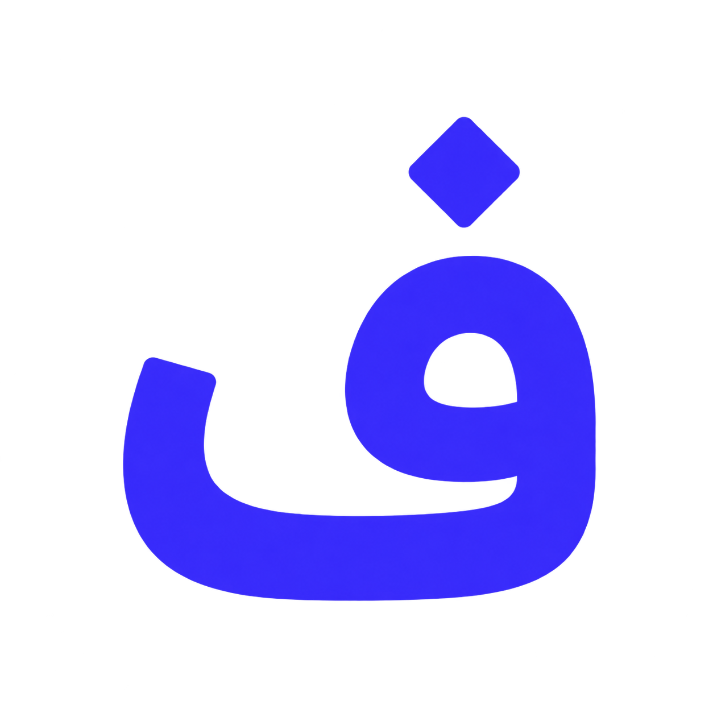

# Farsio - فارسیو

### یار فارسی‌زبان

**Persian-first product engineering for writing, reading, translation, text-to-speech and RTL web experiences.**

[Website](https://farsio.ir) ·
[Products](https://farsio.ir/fa/#products) ·
[Docs](https://farsio.ir/fa/docs) ·
[Repositories](https://github.com/orgs/FarsioIR/repositories)

---

## About Farsio

**Farsio (فارسیو)** builds Persian/Farsi-first software for real browser and web workflows.

Our products focus on areas where Persian users still face friction: **Persian and English writing assistance, Finglish correction, keyboard-layout recovery, RTL UX, web reading, translation, summarization and Persian text-to-speech**.

## Products · محصولات

### NeveshtYar · نوشت‌یار

  

**Farsi Smart Assistant by Farsio**

Local-first Persian & English writing assistance for browser workflows, with emphasis on **Finglish correction, keyboard-layout recovery, spelling assistance, inline correction and RTL-friendly interaction**.

- **Status:** Public
- **Current release:** `v4.9.1`
- **Platforms:** Chromium-family browsers and Firefox
- **Core runtime:** JavaScript · WebExtensions
- **Engineering focus:** local-first processing, explicit user control, deterministic release artifacts, automated quality/security gates
- **Repository:** [FarsioIR/NeveshtYar](https://github.com/FarsioIR/NeveshtYar)
- **Product page:** [farsio.ir/fa/products/neveshtyar](https://farsio.ir/fa/products/neveshtyar)

**بنویس، درست و روان**

### AvaYar · آوایار

  

**Persian Reading & Listening Assistant by Farsio**

A Persian-first product direction for **web reading, translation, summarization and Persian text-to-speech/listening workflows**.

- **Status:** Discovery / Pre-MVP
- **Current repository language:** JavaScript
- **Product direction:** web reading, translation, summarization, listening, accessibility and RTL-first presentation
- **Repository:** [FarsioIR/AvaYar](https://github.com/FarsioIR/AvaYar)
- **Product page:** [farsio.ir/fa/products/ava](https://farsio.ir/fa/products/ava)

**بشنو، به فارسی**

## Technical snapshot

| Surface | Stage | Core technologies | Focus |
|---|---|---|---|
| **NeveshtYar** | Public · v4.9.1 | JavaScript, WebExtensions, Chrome/Chromium, Firefox | Persian/English writing, Finglish, keyboard layout, RTL |
| **AvaYar** | Discovery / Pre-MVP | JavaScript, browser-oriented architecture | Web reading, translation, summarization, Persian TTS |
| **farsio.ir** | Production | TypeScript, React, Vite, Cloudflare Pages | Product web, FA/EN, responsive RTL/LTR |

## Engineering principles

- **Persian-first / RTL-first** — Persian is a first-class product language.
- **Local-first where it matters** — sensitive text processing should stay close to the user whenever architecture allows it.
- **Minimal permissions** — browser permissions and data access should remain limited to product requirements.
- **Cross-browser discipline** — shared behavior across Chromium and Firefox without sacrificing platform correctness.
- **Security and quality gates** — automated checks are part of the delivery path for production-facing code.
- **Reproducible releases** — tags, artifacts, hashes and provenance are treated as engineering assets.
- **Bilingual technical communication** — Persian-first UX with internationally readable engineering material.

## Official repositories

- [NeveshtYar](https://github.com/FarsioIR/NeveshtYar)
- [AvaYar](https://github.com/FarsioIR/AvaYar)
- [farsio.ir](https://github.com/FarsioIR/farsio.ir)
- [.github](https://github.com/FarsioIR/.github)

## Contributing, security and support

- [Contributing](https://github.com/FarsioIR/.github/blob/main/CONTRIBUTING.md)
- [Security](https://github.com/FarsioIR/.github/blob/main/SECURITY.md)
- [Support](https://github.com/FarsioIR/.github/blob/main/SUPPORT.md)
- [Code of Conduct](https://github.com/FarsioIR/.github/blob/main/CODE_OF_CONDUCT.md)

---

Built by [Amir Motefaker](https://github.com/AmirMotefaker).
